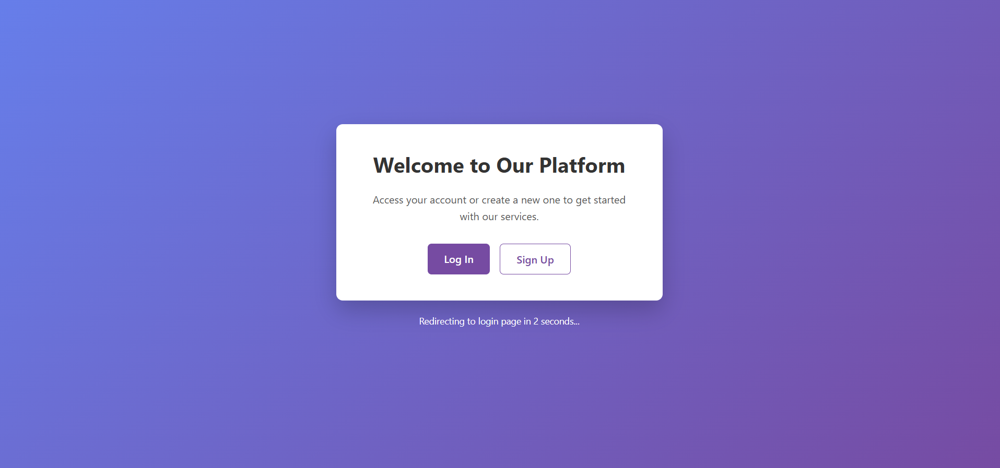
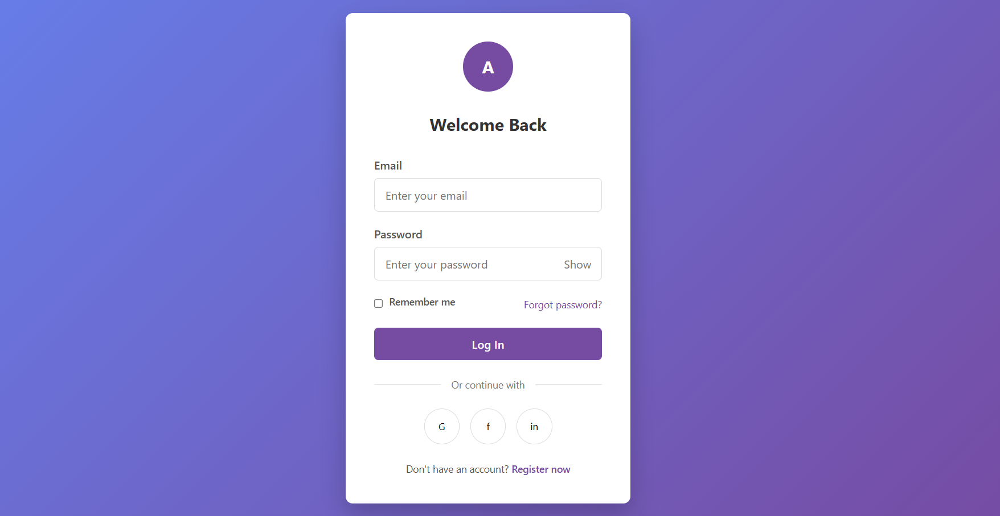
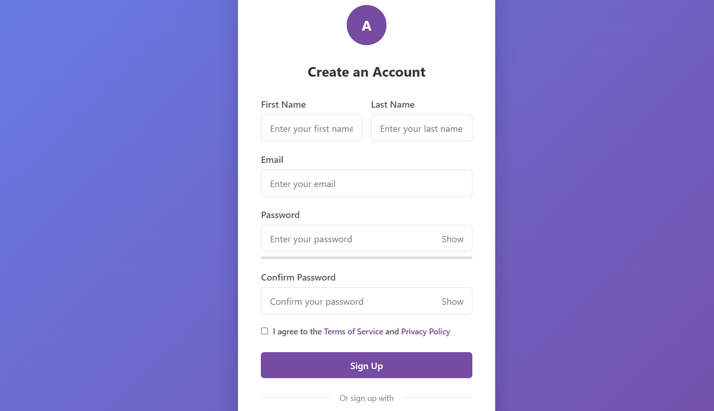

# Responsive Authentication System

A modern, responsive authentication system featuring login and registration pages with a clean, user-friendly design.




## Features

### General Features
- Fully responsive design that works on mobile, tablet, and desktop
- Clean, modern UI with smooth transitions and animations
- Consistent design language across all pages
- Form validation with meaningful error messages
- Accessibility-focused HTML structure

### Login Page (`login.html`)
- Email validation
- Password field with show/hide toggle
- "Remember me" functionality
- Forgot password link
- Social login options
- Link to registration page

### Registration Page (`register.html`)
- First name and last name fields
- Email validation
- Password strength meter
- Password with visibility toggle
- Password confirmation field
- Terms of service checkbox with links
- Social signup options
- Link to login page

### Landing Page (`index.html`)
- Welcome message with call-to-action buttons
- Direct links to both login and registration pages
- Automatic redirection to login page after 5 seconds

## Project Structure

```
responsive-auth-system/
│
├── index.html        # Landing/entry page with redirect to login
├── login.html        # Login form with validation
├── register.html     # Registration form with validation
└── README.md         # This documentation file
```

## Installation & Usage

1. Clone or download this repository
2. Place all files in your web server directory
3. Open `index.html` in a web browser

No external dependencies or build steps are required. The entire system is built with vanilla HTML, CSS, and JavaScript.

## Implementation Details

### HTML
- Semantic HTML5 tags for better accessibility and SEO
- Proper form structure with labels, inputs, and error containers
- Meta viewport tag for responsive design

### CSS
- Flexbox and Grid layout for responsive design
- CSS variables for consistent color scheme
- Mobile-first approach with media queries
- Smooth transitions and hover effects

### JavaScript
- Client-side form validation for immediate user feedback
- Password strength evaluation
- Toggle password visibility
- Navigation between pages
- Auto-redirect functionality on the landing page

## Customization

### Changing Colors
The primary color scheme is based on purple gradients. To change this:
1. Edit the background gradient in the `body` selector
2. Update the button and accent colors (currently `#764ba2` and `#6a3d91`)

### Logo Customization
The current logo is a simple circle with the letter "A". To change this:
1. Find the `.logo-circle` class in each HTML file
2. Replace the content or modify the styling as needed

### Adding Backend Integration
This project includes only the frontend portion of an authentication system. To add backend functionality:

1. Create server-side scripts to handle form submissions:
   - Process login attempts
   - Register new users
   - Store user data securely
   
2. Modify the JavaScript in each HTML file:
   - Update form submission handlers to send data to your backend
   - Implement proper error handling for server responses
   - Add session management for authenticated users

Example form handler modification for login form:

```javascript
document.getElementById('loginForm').addEventListener('submit', function(e) {
    e.preventDefault();
    
    // Client-side validation (already implemented)
    // ...
    
    if (isValid) {
        // Send data to backend
        fetch('/api/login', {
            method: 'POST',
            headers: {
                'Content-Type': 'application/json'
            },
            body: JSON.stringify({
                email: document.getElementById('email').value,
                password: document.getElementById('password').value,
                remember: document.getElementById('remember').checked
            })
        })
        .then(response => response.json())
        .then(data => {
            if (data.success) {
                // Redirect to dashboard or home page
                window.location.href = '/dashboard';
            } else {
                // Show error message
                alert(data.message || 'Login failed');
            }
        })
        .catch(error => {
            console.error('Error:', error);
            alert('An error occurred. Please try again.');
        });
    }
});
```

## Security Considerations

This project includes only frontend components. For a production-ready authentication system, you should implement:

1. **Password Security**:
   - Use bcrypt or similar for password hashing
   - Never store plain-text passwords
   - Implement proper password policies

2. **Form Protection**:
   - Add CSRF protection
   - Implement rate limiting for login attempts
   - Add CAPTCHA for multiple failed attempts

3. **Data Validation**:
   - Always validate data on the server side
   - Sanitize all inputs to prevent injection attacks

4. **Session Management**:
   - Use secure, HTTP-only cookies
   - Implement proper session expiration
   - Consider using JWT for token-based authentication

## Browser Compatibility

This project is compatible with:
- Chrome (latest)
- Firefox (latest)
- Safari (latest)
- Edge (latest)
- Mobile browsers (iOS Safari, Android Chrome)

## License

This project is available under the MIT License.

## Author

Yadhavaramanan C B.Tech

---

## Future Enhancements

Potential future improvements:
- Password reset functionality
- Email verification system
- Two-factor authentication
- Remember me functionality
- OAuth integration for social logins
- Dark/light theme toggle
